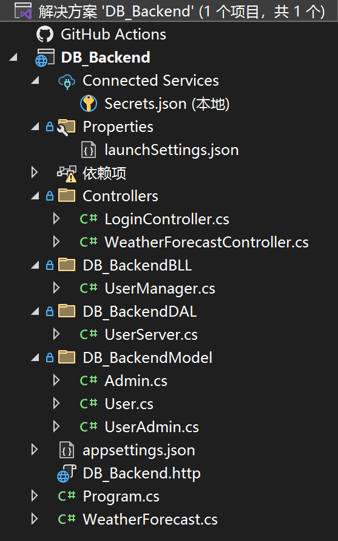
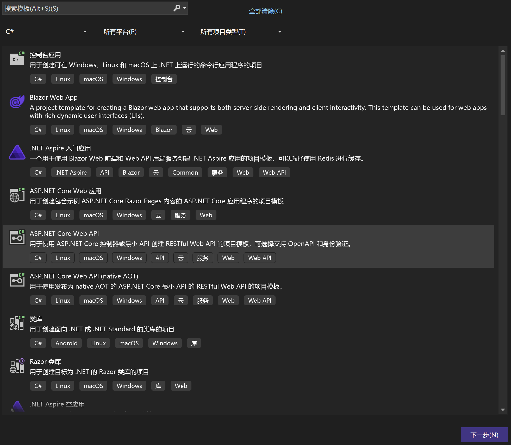
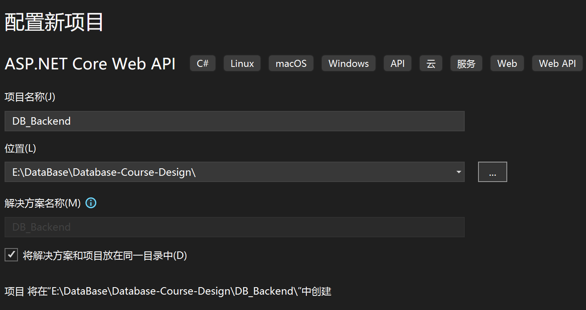
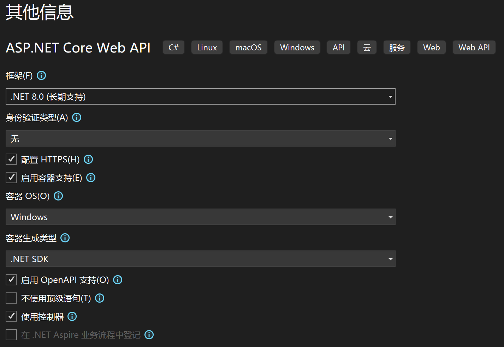
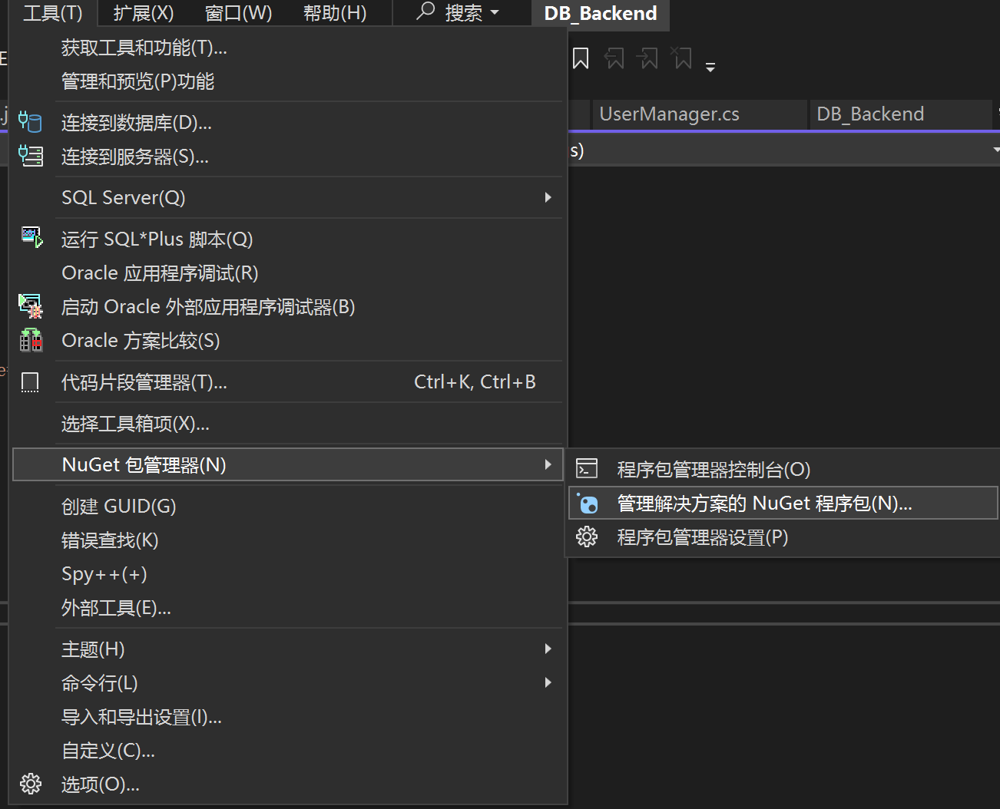

# 项目设计概述

## 1. 项目概述

项目分为三层

- 表示层（UI）
- 业务逻辑层（BLL）
- 数据访问层（DAL）

## 2. 前端概述（UI）

### 2.1. 语言

- HTML5
- CSS3
- TypeScript

### 2.2. 框架

- Vue3

### 2.3. 运行方式

```sh
npm install
npm run dev
// 有包报错先尝试单独解决
// 如果难以解决，可尝试
npm install --force
```

### 2.4. 目录结构

    - public
    - src
        - assets // 静态资源
        - components // 通用组件，组件写在这里，可用到页面中
        - img // 图片
        - router // 路由配置
        - store // Vuex 状态管理
        - views // 页面视图，页面写在这里
        - utils // 工具函数
        - App.vue // 主组件
        - main.ts // 入口文件
    - package.json // 项目依赖

### 2.5. API

#### 2.5.1. API 示例（使用 axios）

详见[TestLogin.vue](/DB_Frontend/src/components/TestLogin.vue#L25)

```typescript
import axios from "axios";
setup() {
    const userId = ref('');
    const password = ref('');
    const errorMessage = ref('');
    const router = useRouter();

    const login = () => {
      axios.post('http://localhost:5000/api/login', {
        User_ID: userId.value,
        Password: password.value
      })
        .then(response => {
          // Handle successful login
          console.log(response.data);
          router.push('/home'); // Redirect to a home page or dashboard
        })
        .catch(error => {
          // Handle errors
          if (error.response) {
            switch (error.response.status) {
              case 401:
                errorMessage.value = 'Invalid credentials';
                break;
              default:
                errorMessage.value = 'An error occurred';
            }
          }
        });
    };

    return {
      userId,
      password,
      errorMessage,
      login
    };
  }
```

#### 2.5.2. 前后端 API 关联

这段后端代码中的 `LoginController` 与前端 Vue 代码通过 API 接口进行交互，主要是通过 HTTP POST 请求实现用户登录功能。以下是二者在接口上的对应关系：

##### 2.5.2.1. URL 路径

- **后端代码**：`[Route("api/[controller]")]` 定义了该控制器的路由为 `api/login`。在 `HttpPost` 方法中，它会响应发送到 `http://localhost:5000/api/login` 的 POST 请求。
- **前端代码**：`axios.post('http://localhost:5000/api/login', {...})` 是前端发送请求的 URL，与后端的路径完全对应。

##### 2.5.2.2. 请求体

- **后端代码**：`Login([FromBody] LoginFormat loginFormat)` 方法接收一个 `LoginFormat` 类型的对象，它包括 `User_ID` 和 `Password` 两个字段。后端从请求体中获取这些字段。
- **前端代码**：`axios.post` 的第二个参数是一个对象 `{ User_ID: userId.value, Password: password.value }`，这与后端的 `LoginFormat` 类的结构相匹配。

##### 2.5.2.3. 请求方法

- **后端代码**：`[HttpPost]` 说明该方法只会响应 POST 请求。
- **前端代码**：`axios.post` 通过 POST 方法向后端发送请求。

##### 2.5.2.4. 响应数据

- **后端代码**：如果登录成功，后端会返回用户信息的 JSON 响应。`responseJson` 包含了用户的 `User_ID`、`Username` 等详细信息。
- **前端代码**：前端通过 `response.data` 获取后端返回的 JSON 数据，并可以进一步处理，如跳转到首页。

### 2.6. 注意事项

**一定注意项目的结构是三层结构，前端为 UI 层，请用 Vue3 编写。若对前端的结构、逻辑等有不清晰的地方，可参考[这里](https://github.com/TongjiPetWelfareProject/DB_PetWelfare)的前端代码。**

## 3. 后端概述（BLL，DAL）

### 3.1. 语言

- C#

### 3.2. 框架

- ASP.NET Core Web API

### 3.3. 目录结构（DB_Backend）



### 3.4 项目创建

- 使用 VS2022
- 创建新项目
  

- 注意命名为 DB_Backend
  

- 配置
  

### 3.5. 连接 Oracle 数据库

- 云服务器 IP 地址为 47.100.21.14
- 云服务器上的 Oracle 数据库已配置好，可以在本地用 C#远程连接

#### 3.5.1. C#连接测试

```csharp
// program.cs
// 以下为测试程序，可在DB_Backend根目录下，用cmd输入dotnet run运行

using Oracle.ManagedDataAccess.Client;

class Program
{
    static void Main(string[] args)
    {
        string conStr = "User ID=system;Password=Db_12306;Data Source=47.100.21.14:1521/orcl";

        using (OracleConnection conn = new OracleConnection(conStr))
        {
            try
            {
                conn.Open();
                Console.WriteLine("Connection successful!");
            }
            catch (Exception ex)
            {
                Console.WriteLine("Connection failed:! " + ex);
            }
        }
    }
}

```

如果报错`ORA-50000: Connection request timed out`
请到`DB_Backend`文件夹下检查`DB_Backend.csproj`文件中的

```csproj
<PackageReference Include="Oracle.ManagedDataAccess.Core" Version="23.5.1" />
```

这一行，Version 是否是`23.5.1`，如果不是，手动改写为上面一行，并在下图位置把`Oracle.ManagedDataAccess.Core`的版本更新到`23.5.1`，然后重新测试。


#### 3.5.2. Sql Plus 连接测试（与前后端代码无关，可不做）

可以通过 Sql Plus 在本地用命令行连接数据库，并进行增删改查操作

```cmd
// 在cmd输入
sqlplus system/Db_12306@47.100.21.14:1521/orcl
```

### 3.5. API

- 这是一个登录的后端 API 简单实现，后续会补充一些判断逻辑，返回形式等
- 目前的效果是，能接收到前端的登录信息，能连接到数据库，但不能成功执行查询语句（后续会修复）
- 详见[这里](/DB_Backend/DB_BackendDAL/UserServer.cs)

```csharp
public static string conStr = "User ID=system;Password=Db_12306;Data Source=47.100.21.14:1521/orcl";
public static User GetUserByUID(string UID)
{
    User user = new User();
    using (OracleConnection connection = new OracleConnection(conStr))
    {
        try
        {
            connection.Open();
            Console.WriteLine("Connection successful in UserServer.cs!");
        }
        catch (Exception ex)
        {
            Console.WriteLine("Connection failed:! " + ex);
        }
        OracleCommand command = connection.CreateCommand();
        command.CommandType = CommandType.Text;
        command.CommandText = "SELECT * FROM USERS WHERE USER_ID=3";
        //command.Parameters.Clear();
        //command.Parameters.Add("user_id", OracleDbType.Varchar2, UID, ParameterDirection.Input);
        Console.WriteLine("UID = " +  UID);
        Console.WriteLine("DEBUG: SQL = " + command.CommandText + " SQL END");
        try
        {
            OracleDataReader reader = command.ExecuteReader();
            while (reader.Read())
            {
                user.User_ID = reader["USER_ID"].ToString();
                user.Username = reader["Username"].ToString();
                //user.Account_Status = reader["Account_Status"].ToString();
                //user.Address = reader["Address"].ToString();
                user.Password = reader["Password"].ToString();
                //user.Phone_Number = reader["Phone_Number"].ToString();
                //user.Role = reader["Role"].ToString();
                //user.Avatar = GetAvatar(reader["User_ID"].ToString());
            }
            if (user.User_ID == "-1")
                throw new Exception("不存在的用户，请注册新用户！");
            else
            {
                Console.WriteLine("this user exists");
                Console.WriteLine(user.Username == null ? "空" : user.Username.ToString());
            }

        }
        catch (Exception ex)
        {
            Console.WriteLine(ex.Message);
        }
    }
    return user;
}
```

### 3.6. 注意事项

**一定注意项目的结构是三层结构，后端为 BLL 和 DAL 两层，若对后端的结构、逻辑等有不清晰的地方，可参考([这里](https://github.com/TongjiPetWelfareProject/TongjiPetWelfare))的完整后端项目。**
